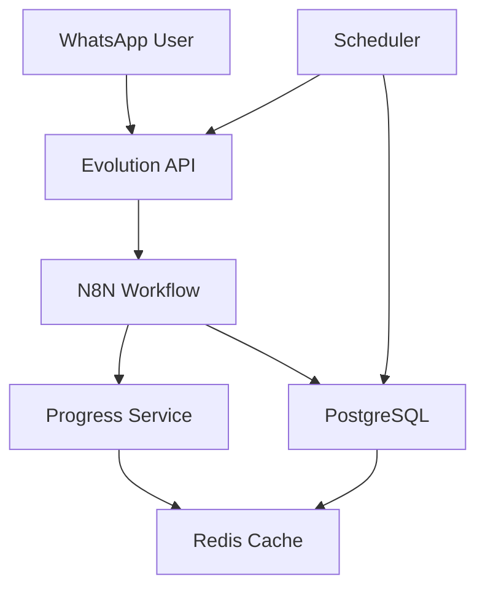

# 📖 Bible Bot - WhatsApp Reading Plan Bot

Um chatbot completo para WhatsApp que ajuda usuários a manterem uma rotina consistente de leitura bíblica com planos personalizados, notificações automáticas e acompanhamento de progresso.

## 🌟 Características Principais

### 📚 Planos de Leitura
- **Bíblia em 1 Ano** (365 dias) - Leitura completa equilibrada
- **Novo Testamento em 3 Meses** (90 dias) - Foco em Jesus
- **Salmos em 30 Dias** - Adoração e reflexão
- **Provérbios em 31 Dias** - Sabedoria diária

### 🔔 Notificações Inteligentes
- Notificações automáticas no horário escolhido pelo usuário
- Mensagens personalizadas com a leitura do dia
- Sistema de lembrete para leituras perdidas
- Mensagens motivacionais baseadas no progresso

### 📊 Acompanhamento de Progresso
- **Relatórios detalhados** com percentual de conclusão
- **Sequência (streak)** de dias consecutivos
- **Estatísticas completas**: dias lidos, perdidos, melhor sequência
- **Barra de progresso visual** para motivação
- **Previsão de conclusão** baseada no ritmo atual

### 💬 Interface Conversacional
- Menu interativo via WhatsApp
- Comandos simples e intuitivos
- Confirmação de leituras realizadas
- Suporte a múltiplos usuários simultâneos

## 🏗️ Arquitetura



### 🧩 Componentes

| Serviço | Função | Porta |
|---------|--------|-------|
| **Evolution API** | Interface WhatsApp | 8080 |
| **N8N** | Orquestração e workflows | 5678 |
| **PostgreSQL** | Banco de dados principal | 5432 |
| **Redis** | Cache e sessões | 6379 |
| **Scheduler** | Notificações automáticas | 3000 |
| **Progress Service** | Cálculo de estatísticas | 3001 |

## 🚀 Instalação Rápida

### 1. Clonar e Preparar

```bash
git clone <seu-repositorio>
cd bible-bot
```

### 2. Iniciar com Docker

```bash
docker-compose up -d
```

# Bible Bot Stack

Stack completa para bot bíblico com N8N, Evolution API, PostgreSQL e Redis.

## Serviços

- **N8N**: Orquestrador de workflows
- **Evolution API**: Interface WhatsApp
- **PostgreSQL**: Banco de dados principal
- **Redis**: Cache e sessões
- **Scheduler**: Serviço de agendamento
- **Progress Service**: Serviço de progresso

## Deploy no Railway

1. Faça fork deste repositório
2. Crie um projeto no Railway
3. Conecte os serviços conforme documentação
4. Configure as variáveis de ambiente

## Desenvolvimento Local

```bash
docker-compose up -d
## 📱 Como Usar

### Para Usuários

| Comando | Descrição |
|---------|-----------|
| `Oi` ou `Menu` | Menu principal |
| `LI` | Marcar leitura como completa |
| `PROGRESSO` | Ver progresso completo |
| `PRÓXIMAS` | Próximas 3 leituras |
| `HISTÓRICO` | Últimas 7 leituras |
| `PLANO` | Mudar plano de leitura |
| `HORÁRIO` | Alterar horário de notificação |
| `CANCELAR` | Cancelar plano atual |

### Fluxo do Usuário

1. **Primeiro Contato**: Usuário envia mensagem
2. **Seleção de Plano**: Escolhe entre 4 opções
3. **Configuração**: Define horário de notificação
4. **Uso Diário**: Recebe notificações e confirma leituras
5. **Acompanhamento**: Visualiza progresso quando desejar

## 📊 Exemplo de Relatório de Progresso

```
📊 SEU PROGRESSO - BÍBLIA EM 1 ANO

✅ Progresso: 87/365 dias (23.8%)
🔥 Sequência atual: 5 dias
📅 Iniciado em: 15/03/2025
⏰ Próxima leitura: Salmos 45-47 (amanhã às 08:00)

📈 ESTATÍSTICAS:
• Leituras realizadas: 87
• Leituras perdidas: 3
• Maior sequência: 12 dias
• Previsão de conclusão: 15/03/2026

████████░░░░░░░░░░░░░░░░░░░░ 23.8%

💪 Muito bom! Você já passou da metade!
```

## 🔧 API Endpoints

### Progress Service (localhost:3001)

| Endpoint | Método | Descrição |
|----------|--------|-----------|
| `/progress/:phoneNumber` | GET | Progresso completo |
| `/report/:phoneNumber` | GET | Relatório formatado |
| `/next-readings/:phoneNumber` | GET | Próximas leituras |
| `/history/:phoneNumber` | GET | Histórico de leituras |
| `/complete/:phoneNumber/:day` | POST | Marcar como lido |
| `/health` | GET | Status do serviço |

### Evolution API (localhost:8080)

| Endpoint | Método | Descrição |
|----------|--------|-----------|
| `/instance/create` | POST | Criar instância |
| `/instance/connect/:name` | GET | Conectar WhatsApp |
| `/message/sendText/:instance` | POST | Enviar mensagem |

## 🗄️ Estrutura do Banco

### Tabelas Principais

- **users** - Dados dos usuários e configurações
- **reading_plans** - Planos de leitura disponíveis  
- **daily_readings** - Leituras organizadas por dia
- **user_progress** - Progresso individual de cada usuário
- **progress_stats** - Estatísticas consolidadas (cache)
- **message_logs** - Log de todas as mensagens

### Funções Importantes

- `calculate_progress_stats()` - Calcula estatísticas de progresso
- `get_next_readings()` - Obtém próximas leituras
- Triggers automáticos para atualizar timestamps

## 📈 Funcionalidades Avançadas

### 🤖 Scheduler Inteligente
- Verifica usuários para notificar a cada minuto
- Evita spam com cache Redis
- Mensagens de encorajamento para usuários inativos
- Limpeza automática de cache antigo

### 🎯 Gamificação
- Sistema de sequências (streaks)
- Estatísticas motivacionais
- Barras de progresso visuais
- Mensagens personalizadas baseadas no desempenho

### ⚡ Performance
- Cache Redis para consultas frequentes
- Connection pooling no PostgreSQL
- Processamento assíncrono de notificações
- Índices otimizados no banco

## 🛡️ Segurança e Backup

### Backup Automático
```bash
# Backup diário do banco
docker exec bible-bot-postgres pg_dump -U bible_user bible_bot > backup-$(date +%Y%m%d).sql
```

### Monitoramento
```bash
# Logs em tempo real
docker logs bible-bot-scheduler -f
docker logs bible-bot-progress -f
```

### Health Checks
- Todos os serviços têm endpoints `/health`
- Docker health checks configurados
- Restart automático em caso de falha

## 🎯 Casos de Uso

### ⛪ Igrejas e Comunidades
- Acompanhar leitura da congregação
- Criar planos temáticos
- Relatórios de engajamento

### 👨‍👩‍👧‍👦 Famílias
- Plano familiar de leitura
- Acompanhar progresso dos filhos
- Criar rotina de devocionais

### 🎓 Grupos de Estudo
- Sincronizar leituras do grupo
- Acompanhar participação
- Discussões baseadas no progresso

## 🔮 Roadmap Futuro

- [ ] **Dashboard Web** para administradores
- [ ] **Planos customizáveis** via interface
- [ ] **Grupos de leitura** com chat
- [ ] **Integração com apps** de leitura bíblica
- [ ] **Multi-idioma** (inglês, espanhol)
- [ ] **Analytics avançados** de engajamento
- [ ] **API pública** para integrações
- [ ] **App mobile** complementar

## 🤝 Contribuição

1. Fork o projeto
2. Crie uma branch (`git checkout -b feature/nova-funcionalidade`)
3. Commit suas mudanças (`git commit -am 'Adiciona nova funcionalidade'`)
4. Push para a branch (`git push origin feature/nova-funcionalidade`)
5. Abra um Pull Request

## 📄 Licença

Este projeto está sob a licença MIT. Veja o arquivo `LICENSE` para mais detalhes.

## 📞 Suporte

- **Issues**: GitHub Issues para bugs e sugestões
- **Documentação**: Wiki do projeto
- **Chat**: Discord da comunidade

---

*"Lâmpada para os meus pés é tua palavra, e luz para o meu caminho."* - Salmos 119:105

Feito com ❤️ para fortalecer o hábito da leitura bíblica diária.